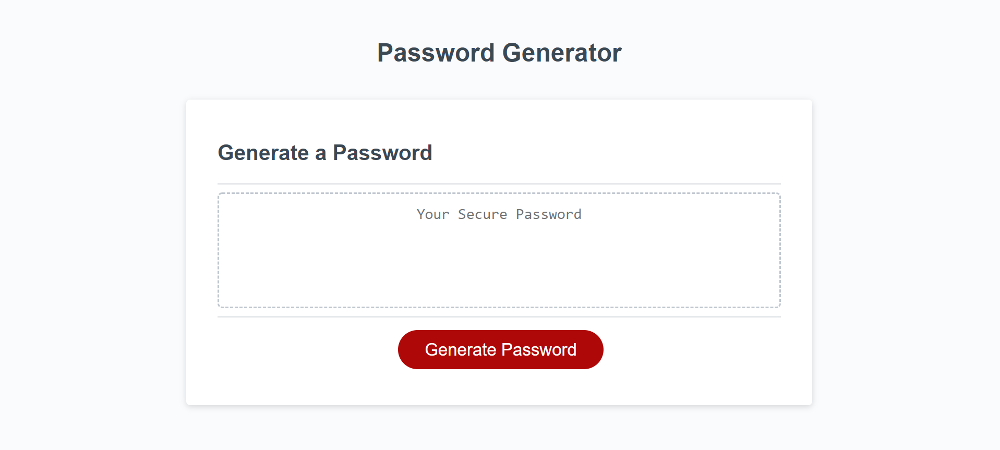

# Javascript-Homework-3

This project uses Javascript to build a password generator that produces a password between 8-127 characters. The user confirms if they want lowercased letters, uppercased letters, numbers, and special characters. Using if then statements, the script concats an array of all the appropriate elements, adds one unique character of each chosen array, shuffles that, shuffles the entire array, and produces a password.

If the user chooses a password length below 8 characters or above 127 characters, the user is alerted to pick a correct password length.

The page can be found on GitHub at [Javascript-Password-Generator](https://jrtwheeler.github.io/Javascript-Password-Generator/).

- Javascript
- JQUERY
- CSS
- HTML
- Bootstrap

